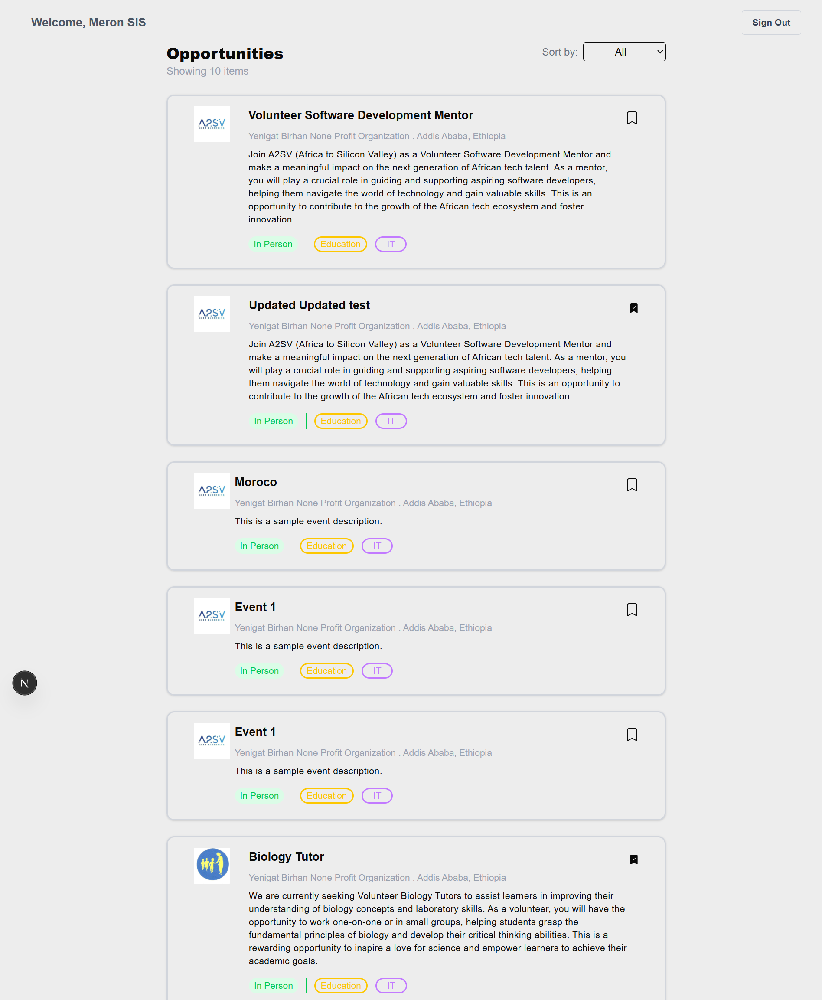
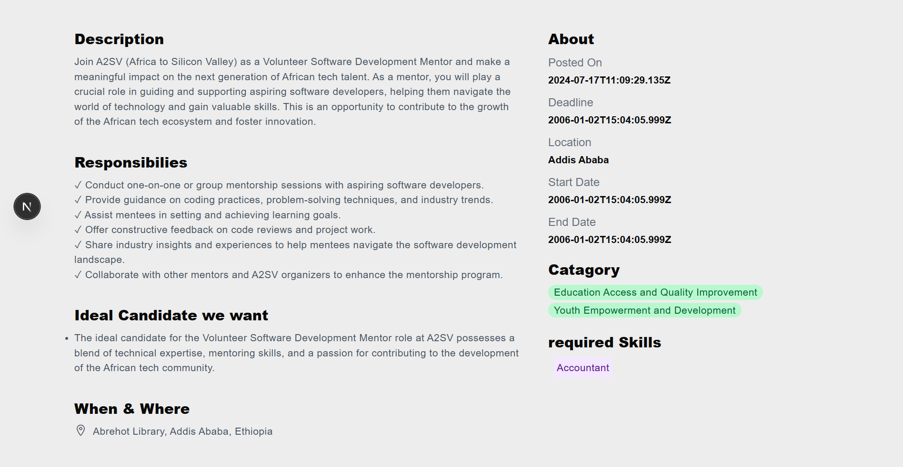
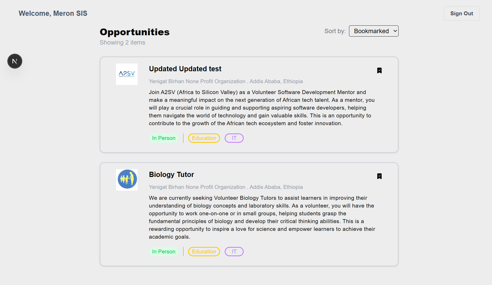
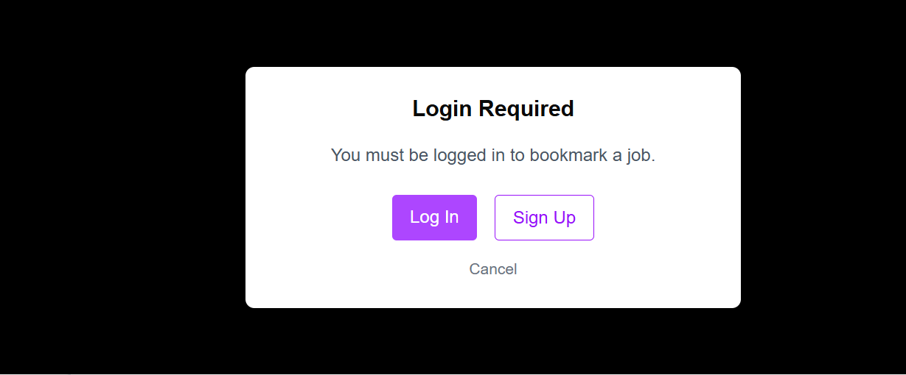
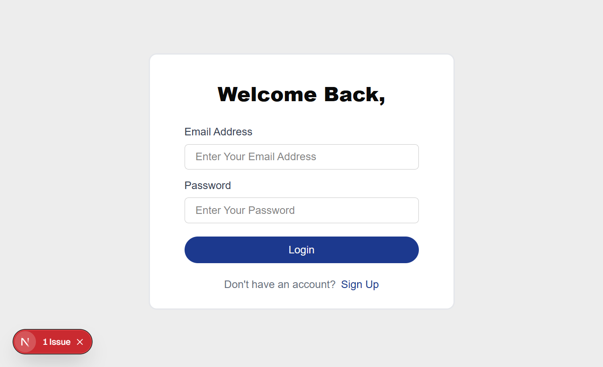
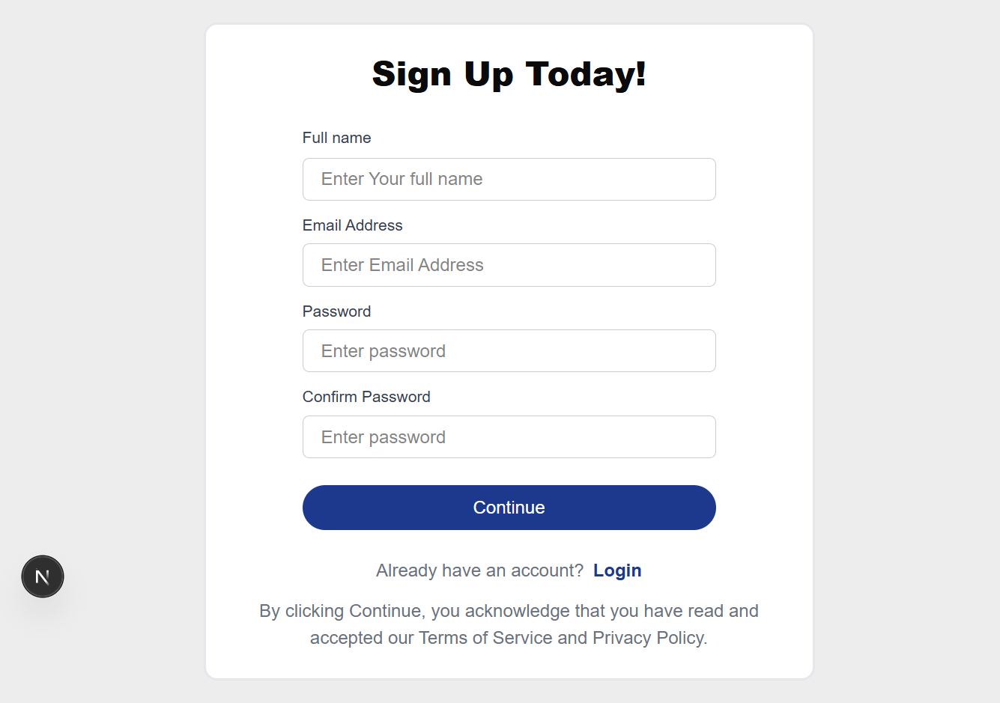
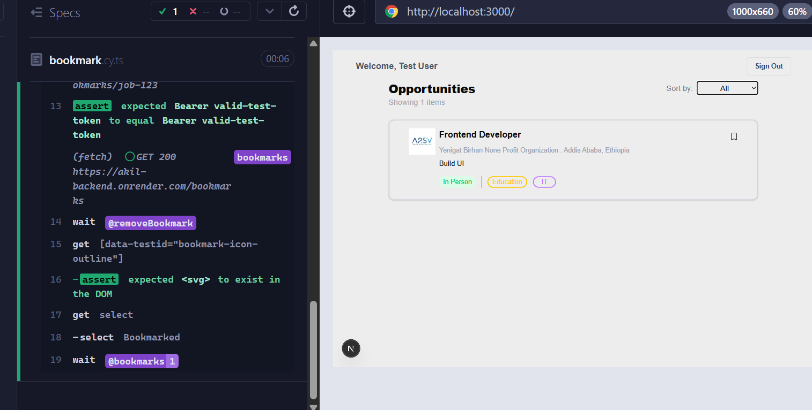
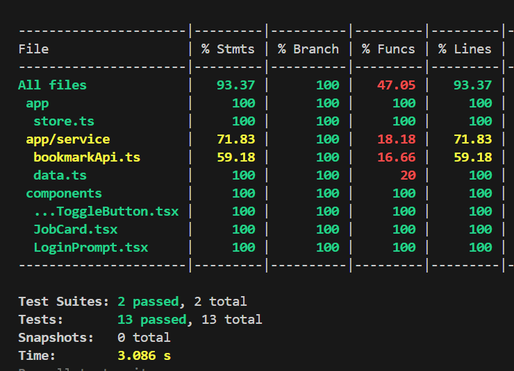

# Job Listing App

A modern, responsive job board application built with **Next.js **, **TypeScript**, **Redux Toolkit Query**, and **Tailwind CSS**. It allows users to explore, filter, and bookmark job postings, with support for authentication using **NextAuth v5**. The app is tested with **Jest** and **Cypress** to ensure reliability.

---

## Features

-  Fetches job postings from a backend API using **RTK Query**
-  View a list of all available jobs
-  Click a job card to view full details on a dynamic route
-  Bookmark/unbookmark jobs (requires login)
-  Filter between **All Jobs** and **Bookmarked Jobs**
-  Login/signup with credentials
-  Restrict bookmark access to authenticated users
-  Shows modal or redirects if unauthenticated users try to bookmark
-  Component-level **unit tests** with **Jest**
- **End-to-End (E2E)** tests with **Cypress**

---

##  Tech Stack

- Next.js
- TypeScript
- Tailwind CSS
- RTK Query
- NextAuth 
- Jest (unit)
- Cypress (E2E)

---

## Screenshots

### Job Listings Page



---

### Job Description Page



---

###  Bookmarked Jobs View



---

###  Login Modal Prompt



---

### Login Page



---

###  SignUp State



---

###  cypress test



---

###  jest unit test



---


## Testing

###  Unit Tests (Jest)

- Component tests for
  - Bookmark toggle
     - npm run test-bookmark
  - Job card
     - npm run test-card
- Run all tests:
```bash
npm run test

### E2E Tests (cypress)
 - Run test 
npm run cypress:open


## 🛠️ Installation & Running Locally

```bash
# 1. Clone the repository
git clone https://github.com/your-username/job-listings-app.git

# 2. Navigate into the project directory
cd job-listings-app-with-nextjs

# 3. Install dependencies
npm install

# 4. Set up environment variables

# 5. Run the development server
npm run dev


