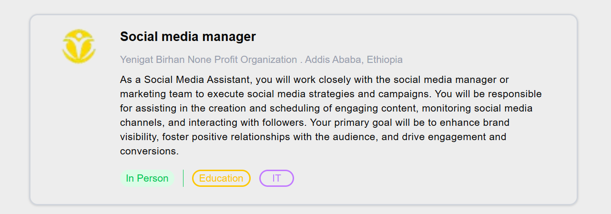
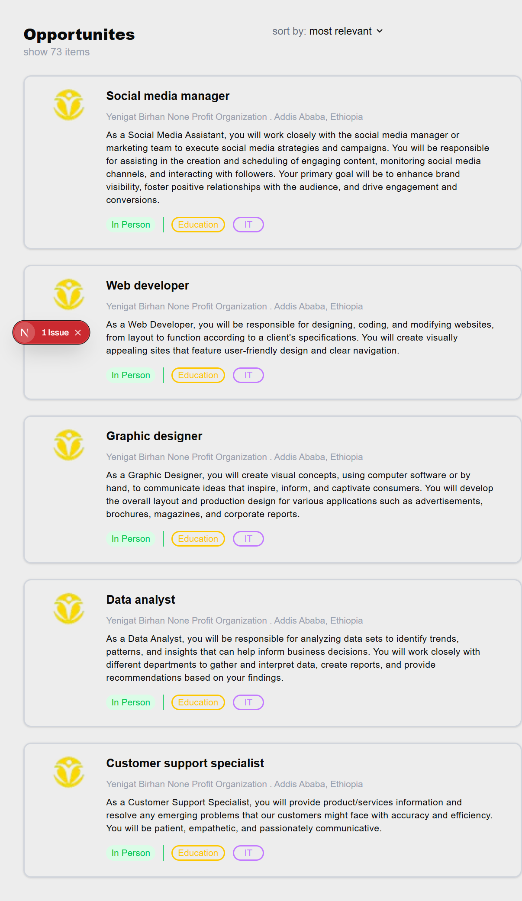
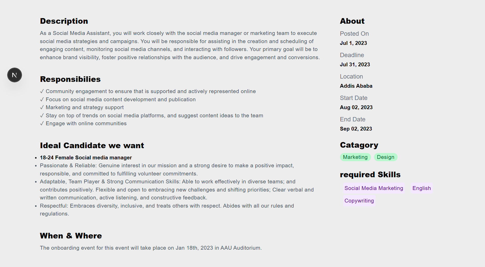

# Job Listi App

This is a simple job board web application built using **Next.js (App Router)**, **TypeScript**, and **Tailwind CSS**. It displays job postings and allows users to view details for each job.

---

##  Features

- View a list of job postings from a local JSON file.
- Click a job to view full job details on a dynamic route.
- Design using Tailwind CSS.
- Modular components:
  - `JobCard` – displays a job summary.
  - `JobDetails` – shows full job information.
- Uses `useParams()` from `next/navigation` for dynamic routing.

---

##  Technologies Used

- **Next.js**
- **TypeScript**
- **Tailwind CSS**
- **React Hooks**
---

## screenshots

# JobCard

# JobLists

# Job Description page

##  How to Run Locally

 Clone this repository
    - git clone https://github.com/your-username/job-listings-app.git
    - cd job-listings-app
    - npm install
    - npm run dev
