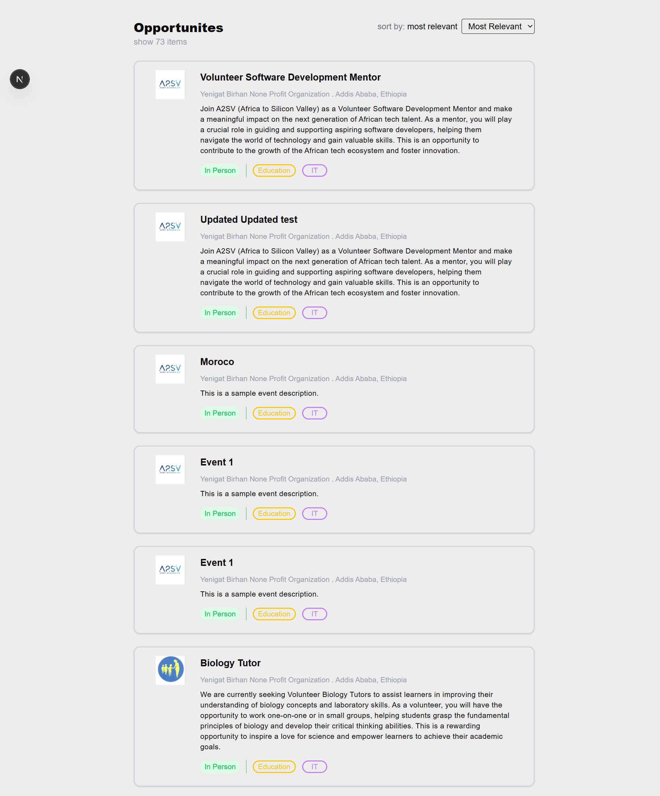

# A2SV Job Listing App

A responsive job board application built with **Next.js**, **TypeScript**, **Redux Toolkit Query**, and **Tailwind CSS**. It fetches job postings via an API, displays them as cards, and provides a dynamic route to view job details.

---

##  Features

- Fetches job postings using **RTK Query** from a backend API.
-  View all job listings on the home page.
-  Click on a job card to view full details.
-  Clean and reusable UI components:
  - `JobCard` – Compact job info preview.
  - `JobDetails` – Full job description and requirements.
-  Built with **TypeScript** and **Tailwind CSS** for type safety and styling.
-  Uses `useParams()` from `next/navigation` for dynamic routing.

---

##  Tech Stack

- Next.js
- TypeScript
- Redux Toolkit Query
- Tailwind CSS
- React

---

## Screenshots

###  Job Listings Page



###  Job Description Page


###  Error state


###  Loading state


---

## 🛠️ Installation & Running Locally

```bash
# 1. Clone the repository
git clone https://github.com/your-username/job-listings-app.git

# 2. Navigate into the project directory
cd job-listings-app

# 3. Install dependencies
npm install

# 4. Run the development server
npm run dev

